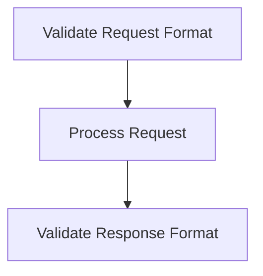

# API Validation Process

> This process validates API requests and responses to ensure they conform to expected formats and standards. It helps maintain the integrity of the system's API.

**Trigger:** API request received  
**Source files:** src/api/routes.ts  

## Flowchart

## Steps

### 1. Validate Request Format

Check that the incoming request adheres to the expected format.

### 2. Process Request

Handle the request if it is valid, otherwise return an error.

### 3. Validate Response Format

Ensure that the outgoing response matches the expected format.

