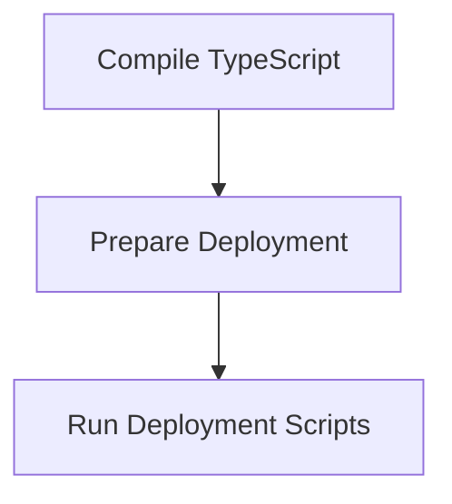

# Build and Deploy Process

> This workflow manages the build and deployment of the DreamGraph application. It compiles TypeScript code into JavaScript and prepares the application for deployment.

**Trigger:** Build command execution  
**Source files:** package.json, tsconfig.json  

## Flowchart

## Steps

### 1. Compile TypeScript

Transpiles TypeScript code into JavaScript using the TypeScript compiler.

### 2. Prepare Deployment

Prepares the compiled code for deployment to the server.

### 3. Run Deployment Scripts

Executes any necessary scripts to deploy the application.

