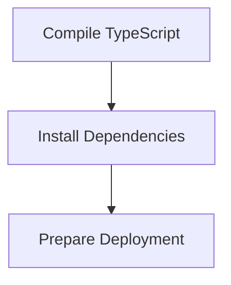

# Build and Deploy Process

> This process compiles the TypeScript code into JavaScript and prepares the application for deployment. It ensures that all dependencies are correctly installed and the application is ready to run.

**Trigger:** Build command execution  
**Source files:** package.json, tsconfig.json  

## Flowchart

## Steps

### 1. Compile TypeScript

Use TypeScript compiler to convert TypeScript files to JavaScript.

### 2. Install Dependencies

Ensure all required dependencies are installed for the application.

### 3. Prepare Deployment

Package the application for deployment to the target environment.

