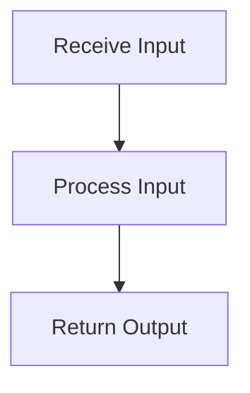

# Cognitive Engine Flow

> This workflow manages the operations of the cognitive engine, including processing inputs and generating outputs based on cognitive models.

**Trigger:** Cognitive processing request  
**Source files:** src/cognitive/engine.ts  

## Flowchart

## Steps

### 1. Receive Input

Accepts input data for processing by the cognitive engine.

### 2. Process Input

Executes cognitive models to generate output.

### 3. Return Output

Sends the generated output back to the requester.

