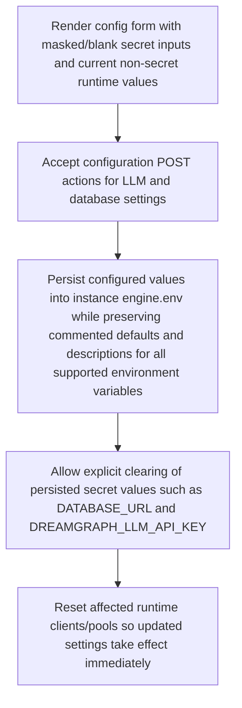

# Dashboard Configuration Management

> Administrators adjust runtime and persisted instance configuration through the dashboard. Secret fields render blank after save, can be revealed temporarily for entry, and persisted values are written to engine.env alongside documented placeholders/defaults for all supported instance environment variables.

**Trigger:** Manual dashboard configuration changes  
**Source files:** src/server/dashboard.ts, src/utils/engine-env.ts, templates/default/config/engine.env  

## Flowchart

## Steps

### 1. Render config form with masked/blank secret inputs and current non-secret runtime values

### 2. Accept configuration POST actions for LLM and database settings

### 3. Persist configured values into instance engine.env while preserving commented defaults and descriptions for all supported environment variables

### 4. Allow explicit clearing of persisted secret values such as DATABASE_URL and DREAMGRAPH_LLM_API_KEY

### 5. Reset affected runtime clients/pools so updated settings take effect immediately

