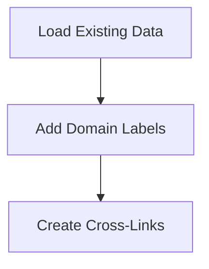

# Data Enrichment Flow

> This workflow enriches the knowledge graph data by adding domain labels, keywords, and cross-links. It enhances the cognitive engine's ability to reason and connect entities.

**Trigger:** Data loading completion  
**Source files:** scripts/enrich-graph.mjs  

## Flowchart

## Steps

### 1. Load Existing Data

Retrieves existing data from JSON files.

### 2. Add Domain Labels

Assigns domain labels to entities based on predefined mappings.

### 3. Create Cross-Links

Establishes relationships between entities to enhance the knowledge graph.

