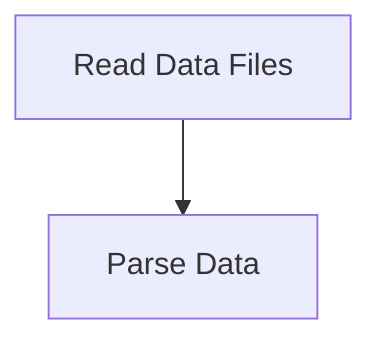

# Data Loading Process

> This workflow is responsible for loading necessary data into the DreamGraph instance. It ensures that all required data files are read and parsed correctly.

**Trigger:** Server initialization  
**Source files:** src/instance/index.ts  

## Flowchart

## Steps

### 1. Read Data Files

Loads data files such as features, workflows, and data models.

### 2. Parse Data

Processes the loaded data into usable formats for the cognitive engine.

