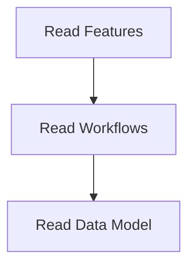

# Data Loading Process

> This process loads necessary data files into the system, ensuring that all required resources are available for operation. It reads from JSON files and prepares the data for use.

**Trigger:** Server initialization  
**Source files:** src/instance/index.ts, scripts/enrich-graph.mjs  

## Flowchart

## Steps

### 1. Read Features

Load features from the features.json file.

### 2. Read Workflows

Load workflows from the workflows.json file.

### 3. Read Data Model

Load data model from the data_model.json file.

