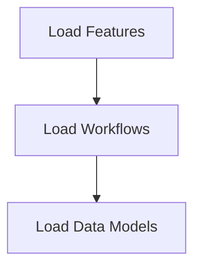

# Data Loading Process

> This process loads necessary data files into the application, ensuring that all required resources are available for processing. It validates the structure of the loaded data.

**Trigger:** Server startup  
**Source files:** src/utils/cache.ts, src/utils/json-store.js  

## Flowchart

## Steps

### 1. Load Features

Load feature definitions from the features.json file.

### 2. Load Workflows

Load workflow definitions from the workflows.json file.

### 3. Load Data Models

Load data model definitions from the data_model.json file.

