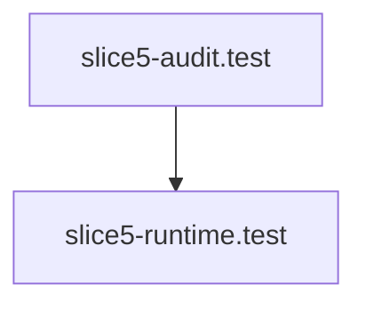

# Test Flow

> Test — 2 source file(s): extensions/vscode/src/test/slice5-audit.test.ts, extensions/vscode/src/test/slice5-runtime.test.ts

**Trigger:** Source: extensions/vscode/src/test/slice5-audit.test.ts  
**Source files:** extensions/vscode/src/test/slice5-audit.test.ts, extensions/vscode/src/test/slice5-runtime.test.ts  

## Flowchart

## Steps

### 1. slice5-audit.test

Implemented in extensions/vscode/src/test/slice5-audit.test.ts

### 2. slice5-runtime.test

Implemented in extensions/vscode/src/test/slice5-runtime.test.ts

