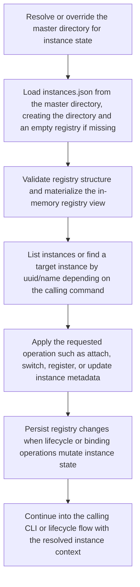

# Instance Registry Access Flow

> Canonical workflow for resolving the master directory, loading the instance registry from disk, locating or enumerating instances, and applying instance lifecycle or binding updates. This flow underpins CLI instance management and instance creation/lifecycle coordination.

**Trigger:** CLI instance-management command or lifecycle operation requiring registry-backed instance lookup/update  
**Source files:** src/instance/registry.ts, src/cli/commands/instances.ts, src/cli/commands/attach.ts, src/instance/lifecycle.ts  

## Flowchart

## Steps

### 1. Resolve or override the master directory for instance state

### 2. Load instances.json from the master directory, creating the directory and an empty registry if missing

### 3. Validate registry structure and materialize the in-memory registry view

### 4. List instances or find a target instance by uuid/name depending on the calling command

### 5. Apply the requested operation such as attach, switch, register, or update instance metadata

### 6. Persist registry changes when lifecycle or binding operations mutate instance state

### 7. Continue into the calling CLI or lifecycle flow with the resolved instance context

