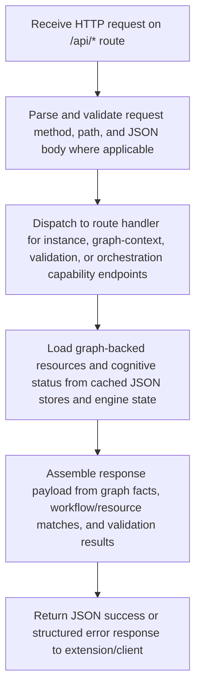

# API Exposure Flow

> Canonical workflow for DreamGraph REST API exposure. Handles HTTP request routing for extension-facing endpoints, validates request payloads, loads graph-backed context and status data, and returns JSON responses. This models API exposure as a first-class workflow rather than only a source area.

**Trigger:** HTTP request to /api/* endpoint  
**Source files:** src/api/routes.ts  

## Flowchart

## Steps

### 1. Receive HTTP request on /api/* route

### 2. Parse and validate request method, path, and JSON body where applicable

### 3. Dispatch to route handler for instance, graph-context, validation, or orchestration capability endpoints

### 4. Load graph-backed resources and cognitive status from cached JSON stores and engine state

### 5. Assemble response payload from graph facts, workflow/resource matches, and validation results

### 6. Return JSON success or structured error response to extension/client

