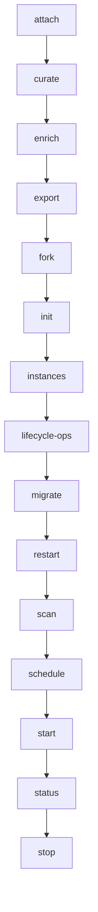

# Commands Flow

> Commands — 15 source file(s): src/cli/commands/attach.ts, src/cli/commands/curate.ts, src/cli/commands/enrich.ts, src/cli/commands/export.ts, src/cli/commands/fork.ts, src/cli/commands/init.ts, src/cli/commands/instances.ts, src/cli/commands/lifecycle-ops.ts, src/cli/commands/migrate.ts, src/cli/commands/restart.ts, src/cli/commands/scan.ts, src/cli/commands/schedule.ts, src/cli/commands/start.ts, src/cli/commands/status.ts, src/cli/commands/stop.ts

**Trigger:** Source: src/cli/commands/attach.ts  
**Source files:** src/cli/commands/attach.ts, src/cli/commands/curate.ts, src/cli/commands/enrich.ts, src/cli/commands/export.ts, src/cli/commands/fork.ts, src/cli/commands/init.ts, src/cli/commands/instances.ts, src/cli/commands/lifecycle-ops.ts, src/cli/commands/migrate.ts, src/cli/commands/restart.ts, src/cli/commands/scan.ts, src/cli/commands/schedule.ts, src/cli/commands/start.ts, src/cli/commands/status.ts, src/cli/commands/stop.ts  

## Flowchart

## Steps

### 1. attach

Implemented in src/cli/commands/attach.ts

### 2. curate

Implemented in src/cli/commands/curate.ts

### 3. enrich

Implemented in src/cli/commands/enrich.ts

### 4. export

Implemented in src/cli/commands/export.ts

### 5. fork

Implemented in src/cli/commands/fork.ts

### 6. init

Implemented in src/cli/commands/init.ts

### 7. instances

Implemented in src/cli/commands/instances.ts

### 8. lifecycle-ops

Implemented in src/cli/commands/lifecycle-ops.ts

### 9. migrate

Implemented in src/cli/commands/migrate.ts

### 10. restart

Implemented in src/cli/commands/restart.ts

### 11. scan

Implemented in src/cli/commands/scan.ts

### 12. schedule

Implemented in src/cli/commands/schedule.ts

### 13. start

Implemented in src/cli/commands/start.ts

### 14. status

Implemented in src/cli/commands/status.ts

### 15. stop

Implemented in src/cli/commands/stop.ts

