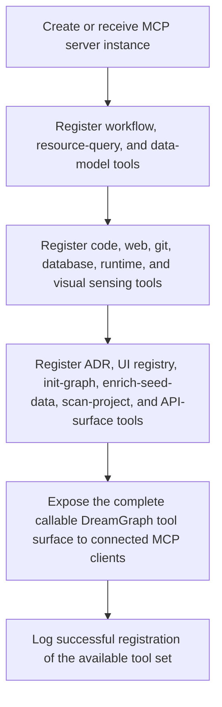

# Tool Execution Flow

> Canonical workflow for MCP tool exposure and execution setup. Registers DreamGraph tools onto the MCP server so clients can discover and invoke graph, cognition, ADR, UI, API-surface, and repository-senses operations through a stable tool surface.

**Trigger:** Daemon/MCP server startup  
**Source files:** src/tools/register.ts  

## Flowchart

## Steps

### 1. Create or receive MCP server instance

### 2. Register workflow, resource-query, and data-model tools

### 3. Register code, web, git, database, runtime, and visual sensing tools

### 4. Register ADR, UI registry, init-graph, enrich-seed-data, scan-project, and API-surface tools

### 5. Expose the complete callable DreamGraph tool surface to connected MCP clients

### 6. Log successful registration of the available tool set

