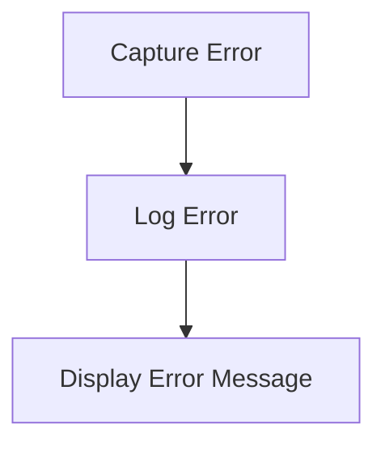

# Error Handling Flow

> This workflow manages errors that occur during the operation of the DreamGraph application. It captures errors, logs them, and provides user-friendly messages when necessary.

**Trigger:** Error occurrence  
**Source files:** src/utils/errors.ts, src/utils/logger.ts  

## Flowchart

## Steps

### 1. Capture Error

Intercepts errors that occur during application execution.

### 2. Log Error

Logs the error details for debugging purposes.

### 3. Display Error Message

Provides a user-friendly error message to the user.

