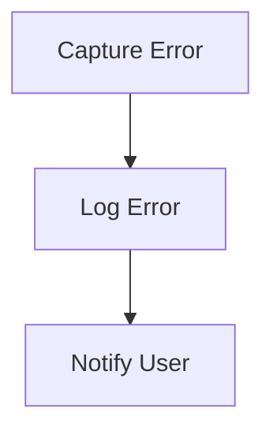

# Error Handling Flow

> This process manages errors that occur during the execution of the application, providing feedback to users and logging errors for further analysis. It ensures that the application remains stable and user-friendly.

**Trigger:** Error occurrence  
**Source files:** src/utils/errors.ts  

## Flowchart

## Steps

### 1. Capture Error

Detect and capture the error that has occurred.

### 2. Log Error

Record the error details in the application logs for analysis.

### 3. Notify User

Provide feedback to the user about the error and possible next steps.

