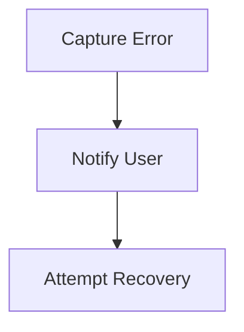

# Error Handling Flow

> This process captures and manages errors that occur during the operation of the application. It ensures that users receive meaningful feedback and that the system can recover gracefully.

**Trigger:** Error occurrence  
**Source files:** src/utils/errors.ts  

## Flowchart

## Steps

### 1. Capture Error

Detect and log the error that has occurred.

### 2. Notify User

Provide feedback to the user regarding the error.

### 3. Attempt Recovery

Try to recover from the error or revert to a safe state.

