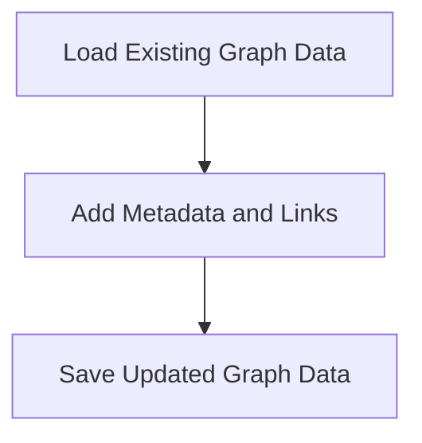

# Graph Enrichment Process

> This process enriches the knowledge graph with additional metadata, keywords, and cross-links to improve the cognitive engine's capabilities. It enhances the relationships between entities in the graph.

**Trigger:** Graph update  
**Source files:** scripts/enrich-graph.mjs  

## Flowchart

## Steps

### 1. Load Existing Graph Data

Read the current graph data from the relevant files.

### 2. Add Metadata and Links

Insert additional metadata and cross-links to the graph entities.

### 3. Save Updated Graph Data

Write the enriched graph data back to the files.

