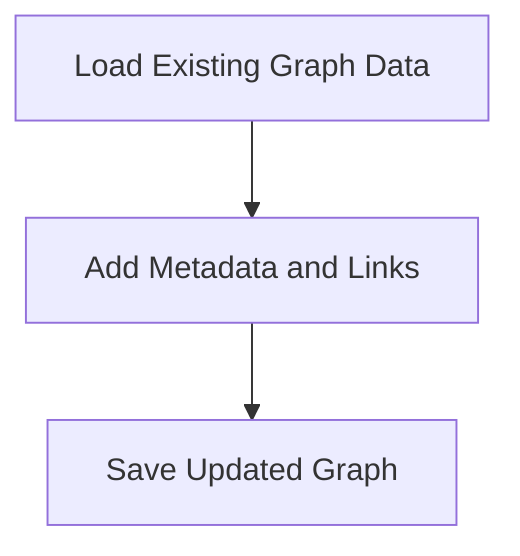

# Graph Enrichment Process

> This process enriches the knowledge graph by adding additional metadata and relationships based on the existing data. It enhances the cognitive capabilities of the system.

**Trigger:** Graph enrichment command  
**Source files:** scripts/enrich-graph.mjs  

## Flowchart

## Steps

### 1. Load Existing Graph Data

Read the current state of the knowledge graph.

### 2. Add Metadata and Links

Insert additional metadata and cross-links to enhance the graph.

### 3. Save Updated Graph

Persist the enriched graph back to the data store.

