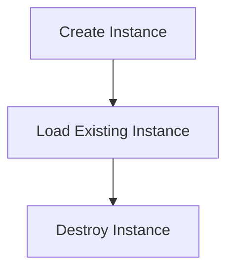

# Instance Lifecycle Flow

> This workflow manages the lifecycle of instances within the DreamGraph application. It handles creation, loading, and destruction of instances based on user commands and system state.

**Trigger:** Instance command execution  
**Source files:** src/instance/lifecycle.ts  

## Flowchart

## Steps

### 1. Create Instance

Creates a new instance based on user specifications.

### 2. Load Existing Instance

Loads an existing instance from storage.

### 3. Destroy Instance

Cleans up and destroys an instance when no longer needed.

