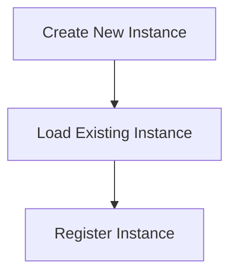

# Instance Management Flow

> Handles the creation, loading, and management of different instances of the DreamGraph application. This workflow ensures that instances are properly registered and managed.

**Trigger:** Instance creation command  
**Source files:** src/instance/index.ts  

## Flowchart

## Steps

### 1. Create New Instance

Initializes a new instance of the application.

### 2. Load Existing Instance

Retrieves and initializes an existing instance.

### 3. Register Instance

Registers the instance in the master registry.

