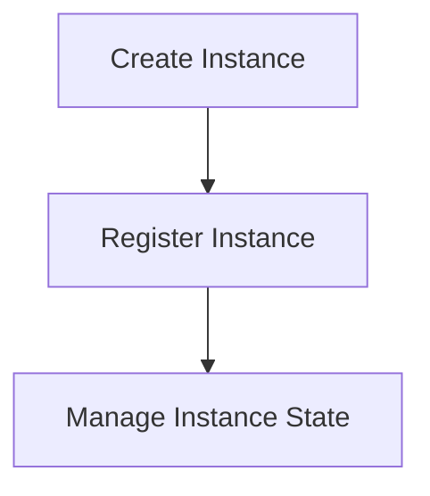

# Instance Management Process

> This process manages the lifecycle of instances within the DreamGraph system, including creation, registration, and state management.

**Trigger:** Instance creation command  
**Source files:** src/instance/lifecycle.ts  

## Flowchart

## Steps

### 1. Create Instance

Initialize a new instance with the specified configurations.

### 2. Register Instance

Add the newly created instance to the system's registry.

### 3. Manage Instance State

Monitor and update the state of the instance as it operates.

