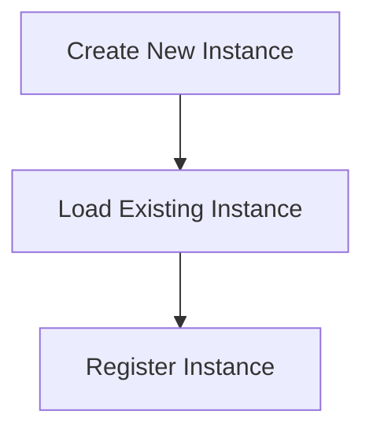

# Instance Management Process

> This process manages the lifecycle of instances within the DreamGraph application, including creation, loading, and registration of instances. It ensures that instances are properly configured and isolated.

**Trigger:** Instance command  
**Source files:** src/instance/index.ts  

## Flowchart

## Steps

### 1. Create New Instance

Initialize a new instance with default settings.

### 2. Load Existing Instance

Load an instance from persistent storage.

### 3. Register Instance

Add the instance to the application registry for management.

