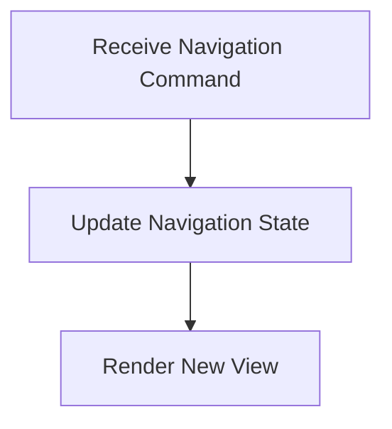

# Navigation Flow

> This workflow handles navigation within the DreamGraph application, allowing users to move between different views and functionalities. It ensures a smooth user experience by managing state and context during navigation.

**Trigger:** User navigation command  
**Source files:** src/ui/navigation.ts  

## Flowchart

## Steps

### 1. Receive Navigation Command

Listens for user commands related to navigation.

### 2. Update Navigation State

Updates the application state based on the navigation command.

### 3. Render New View

Renders the new view based on the updated navigation state.

