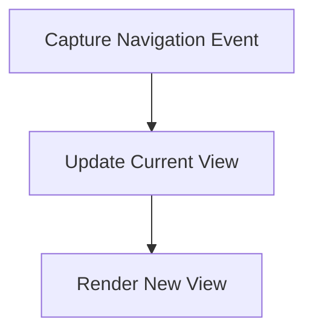

# Navigation Process

> This process handles navigation within the application, allowing users to move between different views or sections. It manages the state of the current view and updates the UI accordingly.

**Trigger:** User navigates  
**Source files:** src/server/dashboard.ts  

## Flowchart

## Steps

### 1. Capture Navigation Event

Detect when a user attempts to navigate to a different view.

### 2. Update Current View

Change the current view state to reflect the user's choice.

### 3. Render New View

Display the new view to the user.

