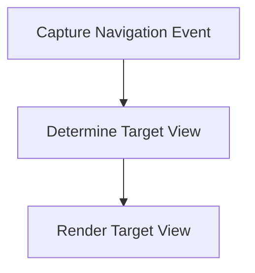

# Navigation Process

> This process handles the navigation within the DreamGraph application, allowing users to move between different views and functionalities seamlessly.

**Trigger:** User interaction with navigation elements  
**Source files:** src/server/dashboard.ts  

## Flowchart

## Steps

### 1. Capture Navigation Event

Detect when a user interacts with navigation elements.

### 2. Determine Target View

Identify the target view or functionality based on the user's action.

### 3. Render Target View

Display the selected view to the user.

