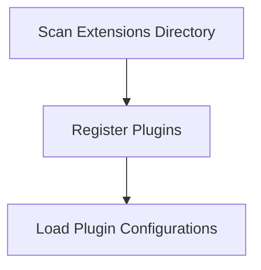

# Plugin Discovery Flow

> This workflow identifies and loads available plugins/extensions for the DreamGraph system. It scans the extensions directory and registers any found plugins for use.

**Trigger:** Application startup  
**Source files:** src/extensions/index.ts  

## Flowchart

## Steps

### 1. Scan Extensions Directory

Searches the extensions directory for available plugins.

### 2. Register Plugins

Registers found plugins for use within the application.

### 3. Load Plugin Configurations

Loads any necessary configurations for the registered plugins.

