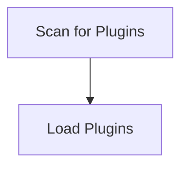

# Plugin Discovery Process

> This workflow identifies and loads available plugins/extensions for the DreamGraph application. It ensures that all relevant plugins are registered and ready for use.

**Trigger:** Server startup  
**Source files:** src/extensions/  

## Flowchart

## Steps

### 1. Scan for Plugins

Searches the extensions directory for available plugins.

### 2. Load Plugins

Initializes and registers the discovered plugins with the application.

