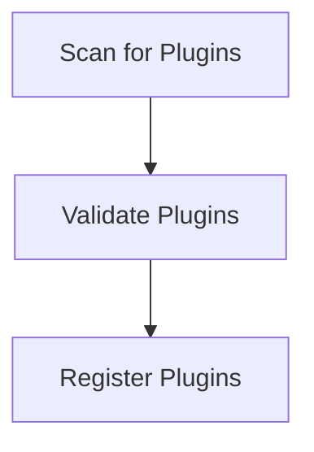

# Plugin Discovery Process

> This process identifies and loads available plugins/extensions for the DreamGraph application, enhancing its functionality. It checks for compatibility and registers the plugins.

**Trigger:** Server startup  
**Source files:** src/instance/registry.ts  

## Flowchart

## Steps

### 1. Scan for Plugins

Search the extensions directory for available plugins.

### 2. Validate Plugins

Check each plugin for compatibility with the current version.

### 3. Register Plugins

Add valid plugins to the application registry for use.

