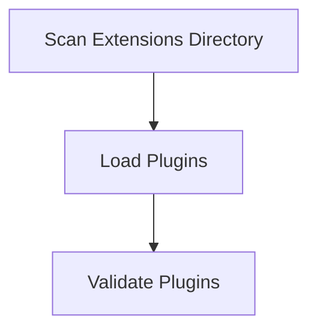

# Plugin Discovery Process

> This process identifies and registers available plugins for the DreamGraph system. It scans the extensions directory and loads any compatible plugins.

**Trigger:** Server startup  
**Source files:** src/instance/registry.ts  

## Flowchart

## Steps

### 1. Scan Extensions Directory

Look for plugin files in the extensions directory.

### 2. Load Plugins

Load and register each discovered plugin into the system.

### 3. Validate Plugins

Check that each loaded plugin meets the necessary criteria for operation.

