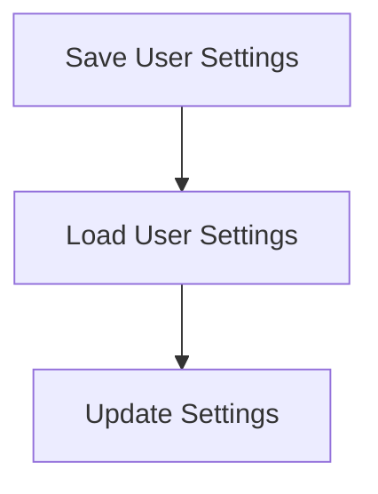

# Settings Persistence Flow

> This workflow manages the saving and loading of user settings and configurations. It ensures that user preferences are stored and retrieved correctly across sessions.

**Trigger:** User settings change  
**Source files:** src/config/config.ts  

## Flowchart

## Steps

### 1. Save User Settings

Stores user settings to a configuration file.

### 2. Load User Settings

Retrieves user settings from the configuration file on startup.

### 3. Update Settings

Updates the stored settings based on user interactions.

