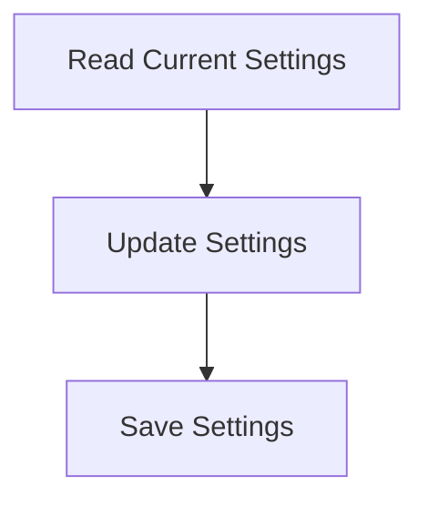

# Settings Persistence Process

> This process saves user settings and configurations to a persistent storage, ensuring that preferences are retained across sessions. It handles reading and writing of configuration files.

**Trigger:** User updates settings  
**Source files:** src/config/config.ts  

## Flowchart

## Steps

### 1. Read Current Settings

Load existing settings from the configuration file.

### 2. Update Settings

Modify settings based on user input.

### 3. Save Settings

Write the updated settings back to the configuration file.

