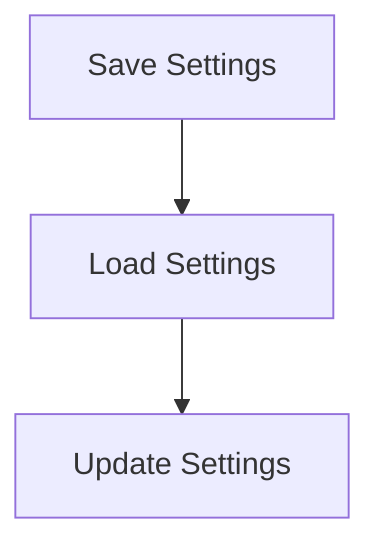

# Settings Persistence Process

> This process manages the saving and loading of user settings and configurations. It ensures that user preferences are stored and can be retrieved across sessions.

**Trigger:** User updates settings  
**Source files:** src/utils/cache.ts  

## Flowchart

## Steps

### 1. Save Settings

Persist user settings to a configuration file.

### 2. Load Settings

Retrieve user settings from the configuration file at startup.

### 3. Update Settings

Allow users to modify and update their settings dynamically.

