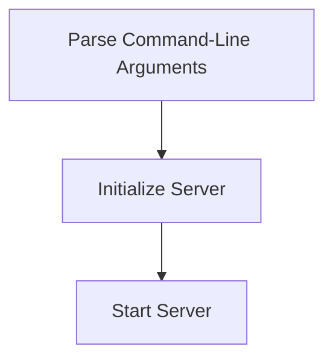

# Startup Initialization Process

> This process initializes the DreamGraph MCP Server, setting up the necessary configurations and starting the server. It handles command-line arguments to determine the transport mode and port settings.

**Trigger:** Server start command  
**Source files:** src/index.ts  

## Flowchart

## Steps

### 1. Parse Command-Line Arguments

Extract transport mode and port from command-line arguments.

### 2. Initialize Server

Create and configure the server based on the parsed arguments.

### 3. Start Server

Begin listening for incoming requests on the specified transport.

