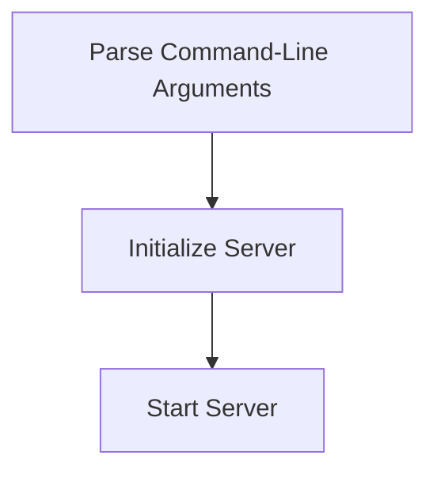

# Startup Initialization Process

> This process initializes the DreamGraph server, setting up necessary configurations and starting the server in the specified transport mode. It handles command-line arguments to configure the server's transport and port settings.

**Trigger:** Server launch  
**Source files:** src/index.ts  

## Flowchart

## Steps

### 1. Parse Command-Line Arguments

Extract transport mode and port from the command-line arguments.

### 2. Initialize Server

Create and configure the server based on the parsed arguments.

### 3. Start Server

Launch the server in the specified transport mode.

