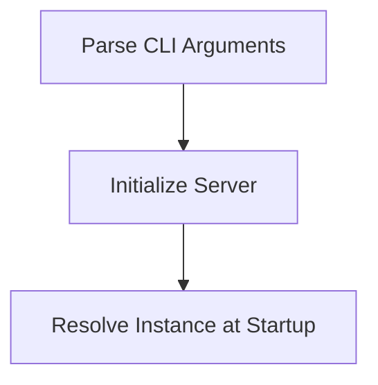

# Startup Process

> This workflow initializes the DreamGraph server, setting up necessary configurations and preparing the environment for operation. It handles command-line arguments to determine the transport mode and port settings.

**Trigger:** Server launch  
**Source files:** src/index.ts, src/server/server.ts, src/instance/index.ts  

## Flowchart

## Steps

### 1. Parse CLI Arguments

Extracts and validates command-line arguments for transport mode and port.

### 2. Initialize Server

Sets up the server based on the specified transport mode.

### 3. Resolve Instance at Startup

Loads the instance configuration and prepares the environment.

