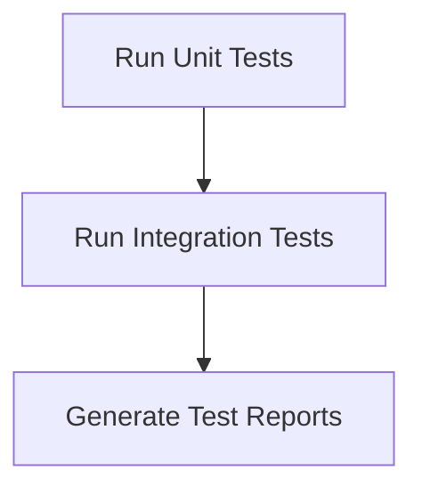

# Testing Process

> This process runs automated tests to verify the functionality and stability of the application. It ensures that changes do not introduce regressions and that the application behaves as expected.

**Trigger:** Test command  
**Source files:** tests/instance-isolation.test.ts, vitest.config.ts  

## Flowchart

## Steps

### 1. Run Unit Tests

Execute unit tests to validate individual components.

### 2. Run Integration Tests

Execute integration tests to validate interactions between components.

### 3. Generate Test Reports

Compile results and generate reports for review.

