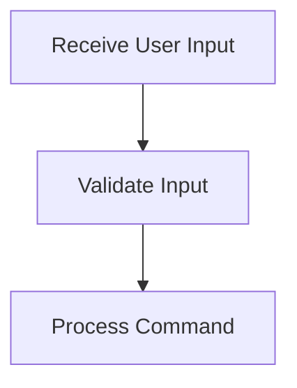

# User Interaction Flow

> This workflow handles user interactions through the command line or HTTP requests, processing commands and returning appropriate responses. It ensures that user inputs are validated and processed correctly.

**Trigger:** User command input  
**Source files:** src/api/routes.ts, src/cli/dg.ts  

## Flowchart

## Steps

### 1. Receive User Input

Listens for user commands via CLI or HTTP.

### 2. Validate Input

Checks the validity of the user input against expected formats.

### 3. Process Command

Executes the command based on user input and returns the result.

