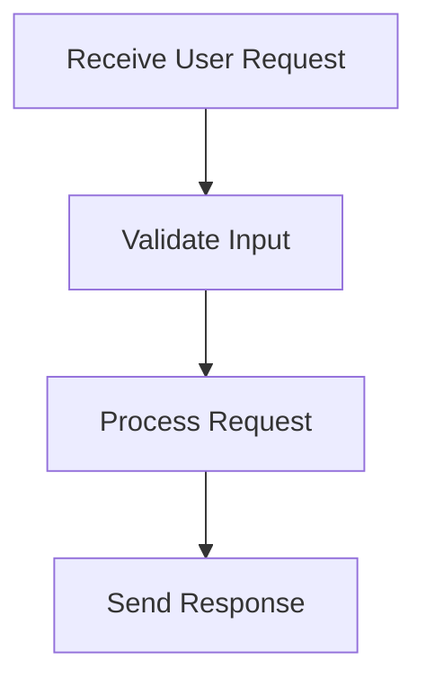

# User Interaction Process

> This process manages user interactions through the CLI and HTTP API, allowing users to send requests and receive responses. It includes validation of input data and error handling.

**Trigger:** User input  
**Source files:** src/api/routes.ts, src/cli/dg.ts  

## Flowchart

## Steps

### 1. Receive User Request

Capture user input from CLI or HTTP requests.

### 2. Validate Input

Check the structure and content of the input data for correctness.

### 3. Process Request

Execute the appropriate action based on the user request.

### 4. Send Response

Return the result of the processed request back to the user.

