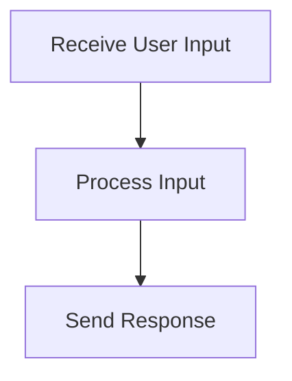

# User Interaction Process

> This process manages interactions with users through the command line or HTTP API. It handles requests and responses, ensuring that user inputs are processed correctly.

**Trigger:** User input via CLI or API  
**Source files:** src/api/routes.ts, src/cli/dg.ts  

## Flowchart

## Steps

### 1. Receive User Input

Capture input from the user through the command line or HTTP request.

### 2. Process Input

Validate and process the input to determine the appropriate action.

### 3. Send Response

Return the result of the processed input back to the user.

