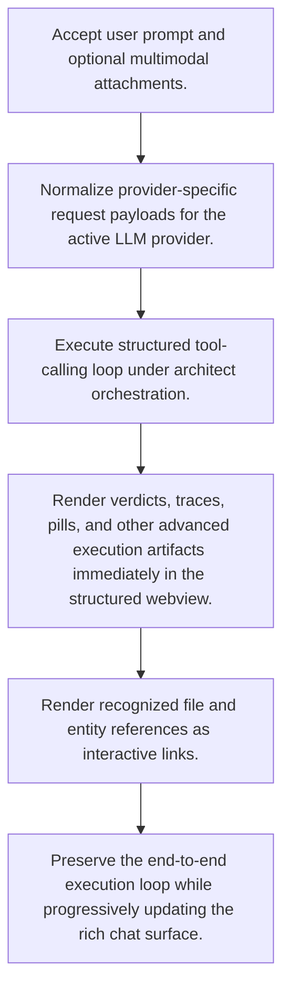

# Architect Agentic Tool Execution

> Auto-generated primary workflow doc. Canonical structured source: data/workflows.json.

> Executes architect chat requests through a structured tool-calling loop and renders rich execution artifacts in the VS Code chat surface.

**Trigger:** User submits a request in the VS Code architect chat panel.  
**Source files:** extensions/vscode/src/architect-llm.ts, extensions/vscode/src/chat-panel.ts, extensions/vscode/media/  

## Flowchart

## Steps

### 1. Accept user prompt and optional multimodal attachments.

Capture the architect request together with any attached context such as images or files.

### 2. Normalize provider-specific request payloads for the active LLM provider.

Translate the request into the provider-specific shape needed for the selected model backend.

### 3. Execute structured tool-calling loop under architect orchestration.

Run the orchestrated reasoning loop that can call tools and iterate toward an answer.

### 4. Render verdicts, traces, pills, and other advanced execution artifacts immediately in the structured webview.

Display rich execution outputs as soon as they are available rather than waiting for a plain final answer.

### 5. Render recognized file and entity references as interactive links.

Convert recognized references into navigable IDE links to improve follow-up exploration.

### 6. Preserve the end-to-end execution loop while progressively updating the rich chat surface.

Keep the tool-execution lifecycle coherent while continuously improving the user-visible chat surface.

