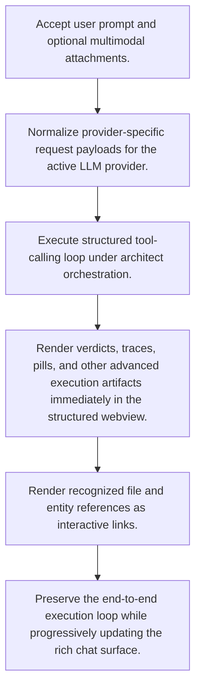

# Architect Agentic Tool Execution

**Trigger:** User submits a request in the VS Code architect chat panel.  
**Source files:** extensions/vscode/src/architect-llm.ts, extensions/vscode/src/chat-panel.ts, extensions/vscode/media/  

## Flowchart

## Steps

### 1. Accept user prompt and optional multimodal attachments.

### 2. Normalize provider-specific request payloads for the active LLM provider.

### 3. Execute structured tool-calling loop under architect orchestration.

### 4. Render verdicts, traces, pills, and other advanced execution artifacts immediately in the structured webview.

### 5. Render recognized file and entity references as interactive links.

### 6. Preserve the end-to-end execution loop while progressively updating the rich chat surface.

