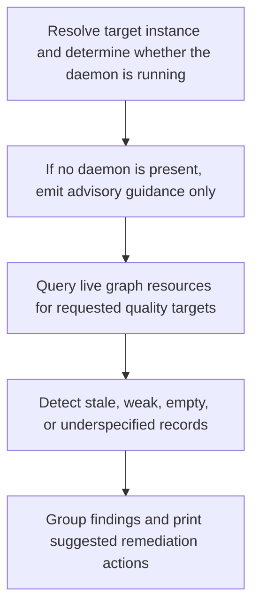

# CLI Curate Audit

> Auto-generated primary workflow doc. Canonical structured source: data/workflows.json.

> The dg curate workflow inspects graph quality on a running daemon by querying features, workflows, data model entities, and ADRs, then groups findings and suggests next actions. If no daemon is running, it emits advisory-only guidance.

**Trigger:** dg curate <instance>  
**Source files:** src/cli/commands/curate.ts, src/cli/dg.ts  

## Flowchart

## Steps

### 1. Resolve target instance and determine whether the daemon is running

Figure out which instance to audit and whether live graph inspection is possible.

### 2. If no daemon is present, emit advisory guidance only

Fall back to non-live guidance when the system cannot query a running daemon.

### 3. Query live graph resources for requested quality targets

Inspect the live graph for workflows, features, data model entities, and ADR coverage.

### 4. Detect stale, weak, empty, or underspecified records

Identify graph quality gaps that should be curated or remediated.

### 5. Group findings and print suggested remediation actions

Present the audit output in a way that guides the next graph-improvement steps.

