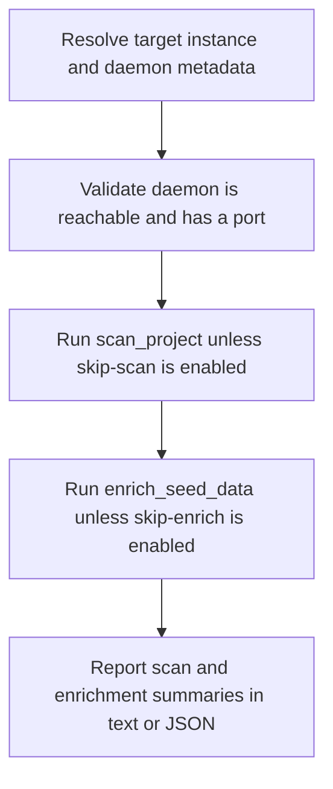

# CLI Enrich Pipeline

> The dg enrich workflow resolves the target instance, verifies a running daemon, optionally scans the project, runs enrich_seed_data, and reports graph coverage improvements.

**Trigger:** dg enrich <instance>  
**Source files:** src/cli/commands/enrich.ts, src/cli/dg.ts  

## Flowchart

## Steps

### 1. Resolve target instance and daemon metadata

### 2. Validate daemon is reachable and has a port

### 3. Run scan_project unless skip-scan is enabled

### 4. Run enrich_seed_data unless skip-enrich is enabled

### 5. Report scan and enrichment summaries in text or JSON

