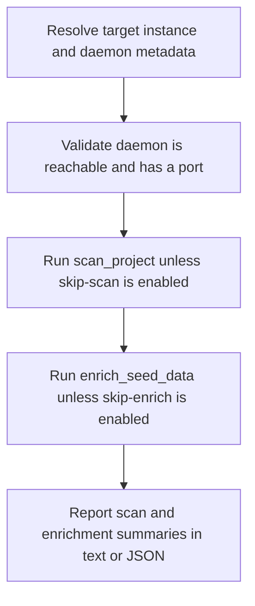

# CLI Enrich Pipeline

> Auto-generated primary workflow doc. Canonical structured source: data/workflows.json.

> The dg enrich workflow resolves the target instance, verifies a running daemon, optionally scans the project, runs enrich_seed_data, and reports graph coverage improvements.

**Trigger:** dg enrich <instance>  
**Source files:** src/cli/commands/enrich.ts, src/cli/dg.ts  

## Flowchart

## Steps

### 1. Resolve target instance and daemon metadata

Identify the instance to enrich and gather the daemon connection details needed for the operation.

### 2. Validate daemon is reachable and has a port

Confirm the target daemon is running and can accept enrichment-related requests.

### 3. Run scan_project unless skip-scan is enabled

Optionally refresh structural and semantic understanding before enrichment begins.

### 4. Run enrich_seed_data unless skip-enrich is enabled

Upsert seed knowledge into the graph so the instance becomes more complete and queryable.

### 5. Report scan and enrichment summaries in text or JSON

Return a usable summary of the operation and the resulting graph coverage changes.

