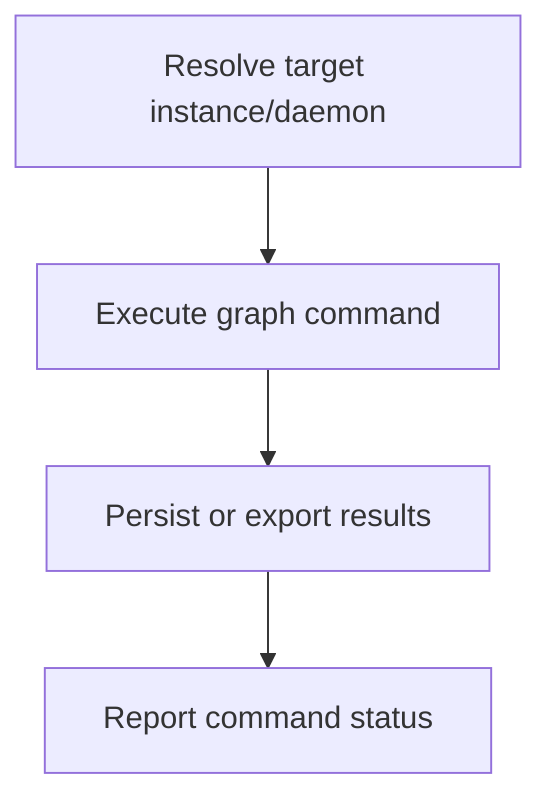

# CLI Graph Operations

> CLI-driven lifecycle for init, scan, enrich, export, and status operations against the DreamGraph daemon and local project graph.

**Trigger:** CLI command execution  
**Source files:** src/cli/commands/init.ts, src/cli/commands/scan.ts, src/cli/commands/enrich.ts, src/cli/commands/export.ts, src/cli/commands/status.ts, src/cli/utils/daemon.ts, src/cli/utils/mcp-call.ts  

## Flowchart

## Steps

### 1. Resolve target instance/daemon

### 2. Execute graph command

### 3. Persist or export results

### 4. Report command status

