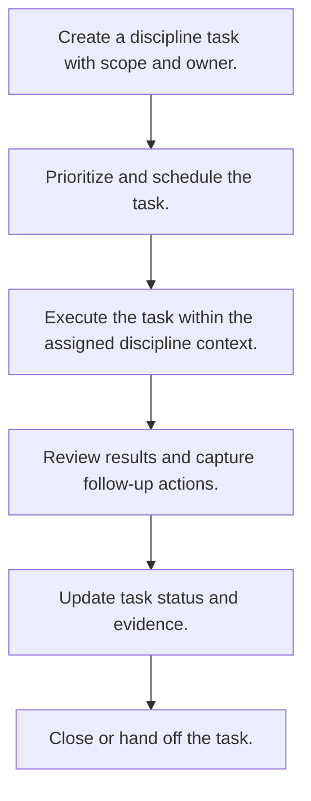

# Discipline Task Lifecycle

> Auto-generated primary workflow doc. Canonical structured source: data/workflows.json.

> Tracks how a discipline task is created, progressed, reviewed, and closed while keeping ownership and status transitions explicit.

**Trigger:** task creation or discipline status transition  
**Source files:** src/disciplines/task-manager.ts, src/disciplines/session.ts  

## Flowchart

## Steps

### 1. Create a discipline task with scope and owner.

Open a task record that captures the requested work, responsible discipline, and initial constraints.

### 2. Prioritize and schedule the task.

Place the task into the discipline backlog or active queue according to urgency and dependencies.

### 3. Execute the task within the assigned discipline context.

Perform the work while preserving the discipline-specific tools, prompts, and boundaries.

### 4. Review results and capture follow-up actions.

Assess whether the task outcome satisfies the intent and whether more work must be spawned.

### 5. Update task status and evidence.

Record completion notes, evidence, or blockers so later sessions can understand the state.

### 6. Close or hand off the task.

Finish the lifecycle by marking the task complete or transferring ownership for the next stage.

