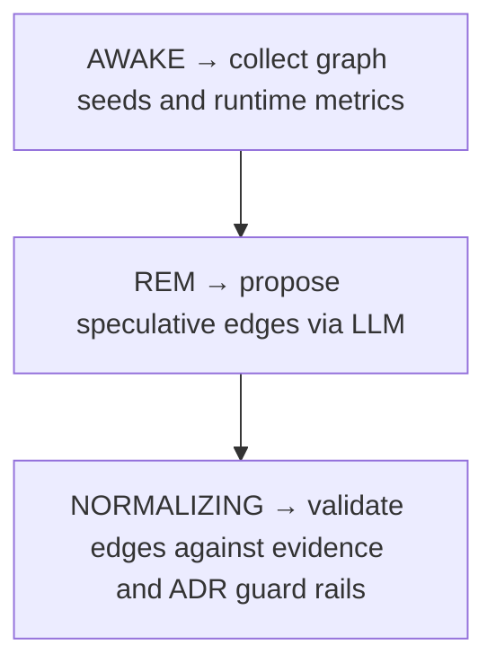

# Dream Cycle

> Auto-generated primary workflow doc. Canonical structured source: data/workflows.json.

> Primary cognitive workflow that drives speculative discovery and validation across the knowledge graph.

**Trigger:** manual_or_scheduled  
**Source files:** src/cognitive/engine.ts, src/cognitive/dream-state-machine.ts  

## Flowchart

## Steps

### 1. AWAKE → collect graph seeds and runtime metrics

Gather current graph state, tensions, and runtime signals needed to start a cognitive cycle.

### 2. REM → propose speculative edges via LLM

Generate candidate relationships and hypotheses from the available evidence using model-assisted reasoning.

### 3. NORMALIZING → validate edges against evidence and ADR guard rails

Validate proposed edges against available evidence, accepted ADR constraints, and confidence thresholds before solidifying them.

