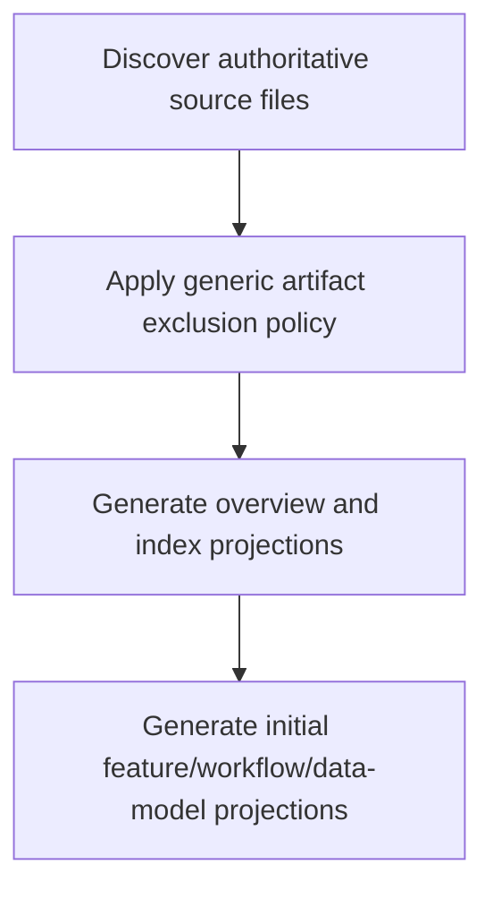

# Graph Bootstrap

> Repository graph bootstrap that initializes overview, index, features, workflows, and data-model projections from authoritative source trees.

**Trigger:** init_graph invocation  
**Source files:** src/tools/init-graph.ts, src/tools/scanner-artifact-policy.ts  

## Flowchart

## Steps

### 1. Discover authoritative source files

### 2. Apply generic artifact exclusion policy

### 3. Generate overview and index projections

### 4. Generate initial feature/workflow/data-model projections

