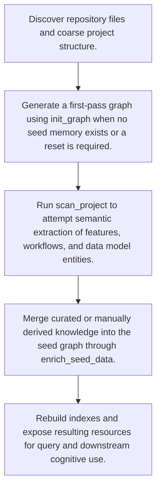

# Project Onboarding and Enrichment

> Auto-generated primary workflow doc. Canonical structured source: data/workflows.json.

> High-level onboarding workflow that scans the repository, bootstraps or enriches the fact graph, and rebuilds indexable architectural memory for later querying and cognition.

**Trigger:** repository onboarding or refresh  
**Source files:** src/tools/init-graph.ts, src/tools/scan-project.ts, src/tools/enrich-seed-data.ts  

## Flowchart

## Steps

### 1. Discover repository files and coarse project structure.

Enumerate project files and derive an initial structural picture of the repository.

### 2. Generate a first-pass graph using init_graph when no seed memory exists or a reset is required.

Initialize baseline graph memory when the project has not yet been seeded or must be rebuilt.

### 3. Run scan_project to attempt semantic extraction of features, workflows, and data model entities.

Scan the codebase to extract structured knowledge candidates for the graph.

### 4. Merge curated or manually derived knowledge into the seed graph through enrich_seed_data.

Upsert curated features, workflows, and data-model entities into the graph seed data.

### 5. Rebuild indexes and expose resulting resources for query and downstream cognitive use.

Refresh graph indexes and resource views so the newly captured knowledge becomes queryable and usable by later cognition.

